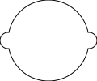
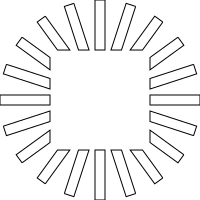
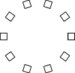
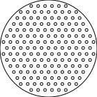
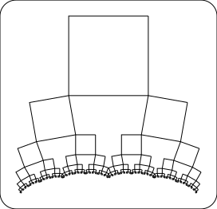
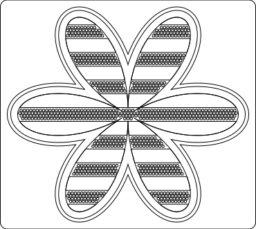

# SHapely ARt Tools

Fluent api wrapper around shapely geometry library.

# Why
Shapely is a very powerful library with awesome features,
but I find its API to be a bit verbose at times. I created
this lib to make my life a bit easier creating laser cutter
art projects.

# Limitations
Since this lib is just a glorified wrapper class, it has the
same limitations shapely does. Namely it does not support
"true" curves (everything is a polygon). I get around this by
estimating the number of segments required for e.g. a circle
based on its size, but it's important to be aware that if you
create a tiny circle and scale it up 100 times it won't be
infinitely detailed. Same goes for any other curve objects.

# Install

At some point I'll get around to adding this to the PIP repository thing.

Clone repo and run
```bash
./build-and-install.sh
```

Note you need the usual set of dependencies required when building pip packages.

# Example Use

Central class of the API is a Group, which is a collection of one or more
geometric objects (backed by a shapely MultiPolygon):

## You can render directly to SVG (Using PyCairo)

`svg_generator` is a lambda that accepts width/height arguments and provides
a cairo surface from which a render context can be created. Use your own
lambda for alternative outputs.

```python
Group.circle(0, 0, 100).render(Group.svg_generator("doc/circle"))
```


## Multiple shapes are allowed

```python
Group.circle(0, 0, 100) \
    .add(Group.circle(0, 0, 50)) \
    .render(Group.svg_generator("doc/circle-add"))
```


## Group is immutable so you can easily perform multiple transformations using the same base group

```python
from shart import Group

outer_circle = Group.circle(0, 0, 100)

inner_circle = Group.circle(0, 0, 20)

outer_circle \
    .add(inner_circle.to(50, 0)) \
    .add(inner_circle.to(-50, 0)) \
    .render(Group.svg_generator("doc/circles"))

```



## Using union()

```python
outer_circle \
    .add(inner_circle.to(50, 0)) \
    .add(inner_circle.to(-50, 0)) \
    .union() \
    .render(Group.svg_generator("doc/circles-union"))
```


## Boolean operations

```python
center_rect = Group.rect_centered(0, 0, 100, 100)

spin_rects = Group.rect(0, -5, 100, 10)

spin_rects \
        .spin(0, 0, 20, should_rotate=True) \
        .difference(center_rect) \
        .union() \
        .render(Group.svg_generator("doc/boolean"))
```



## Using spin()

```python
Group.rect_centered(50, 0, 10, 10) \
    .spin(0, 0, 10, should_rotate=True) \
    .render(Group.svg_generator("doc/rects"))
```



## Using linarray()

Pass in a lambda which applies the desired transformation for a given increment

```python
roup.rect_centered(0, 0, 10, 10) \
       .linarray(10,
               lambda i, g: g.to(i * 20, 0).rotate(i * 10, use_radians=False)) \
       .render(Group.svg_generator("doc/rects-linarray"))
```


## Hexagonal arrays/tiling

### The easy way, using Coordinates

```python
from shart import Coordinates

container = Group.circle(70, 70, 140)

Group() \
        .add_all(Group.circle(c[0], c[1], 4) for c in Coordinates.hex(17, 17, 10)) \
        .filter(lambda g: container.contains(g)) \
        .add(container) \
        .render(Group.svg_generator("doc/hexagons", fill_background=True))
```


### The hard way, using math (shudder...)

Hexagonal tiles are just arrays with varying numbers of elements in each row.
For a hexagonal arrangement, column (x) spacing is some length l, then row
spacing will be sqrt(3/4)l. In addition, oddly numbered rows will be offset
by l/2.

With this information it's possible to determine the necessary 2d array coords:

```python
lattice_spacing = 10

row_count = 17
col_count = 17

def gen_row(row_number, g):
    num_cols = col_count if row_number % 2 == 0 else col_count - 1

    row_y = row_number * math.sqrt(3 / 4) * lattice_spacing
    col_x = 0 if row_number % 2 == 0 else lattice_spacing / 2

    # create the first row element
    row_start = g.translate(col_x, row_y)

    # fill in the remainder of the row
    return row_start.linarray(
            num_cols,
            lambda i, g: g.translate(i * lattice_spacing, 0))

lattice = Group.circle(0, 0, 4).linarray(row_count, gen_row)

container = Group.circle(70, 70, 140)

lattice.filter(lambda g: container.contains(g)) \
    .add(container) \
    .render(Group.svg_generator("doc/hexagons-hard", fill_background=True))

```

Also here I use `filter()` to only include the circles inside the larger circle.

The result is the same.



## Fractals (Hey dawg I heard you like hey dawg I heard you like hey dawg I heard...)

Use the `recurse()` method to generate recursive subgeometries:

```python
def fractal_visitor(g):
    scale = 0.8
    angle = 50

    pa = g.geoms.geoms[0].boundary.coords[-2]
    pb = g.geoms.geoms[0].boundary.coords[1]

    pab = tuple(np.subtract(pb, pa))

    subgroup = g.translate(pab[0], pab[1]) \
            .scale(scale, origin=pb) \
            .rotate(angle, origin=pb, use_radians=False)


    return [ subgroup ]

Group.rect(0, 0, 100, 100) \
    .recurse(fractal_visitor, 60) \
    .border(20, 20) \
    .render(Group.svg_generator("doc/recurse-single", fill_background=True))

```


```python
def branching_fractal_visitor(g):
    scale = 0.5
    angle = 10

    top_right = g.geoms.geoms[0].boundary.coords[0]
    top_left = g.geoms.geoms[0].boundary.coords[-2]
    bottom_right = g.geoms.geoms[0].boundary.coords[1]
    bottom_left = g.geoms.geoms[0].boundary.coords[2]

    tl_br = tuple(np.subtract(bottom_right, top_left))
    tr_bl = tuple(np.subtract(bottom_left, top_right))

    subgroup1 = g.translate(tl_br[0], tl_br[1]) \
            .scale(scale, origin=bottom_right) \
            .rotate(angle, origin=bottom_right, use_radians=False)

    subgroup2 = g.translate(tr_bl[0], tr_bl[1]) \
            .scale(scale, origin=bottom_left) \
            .rotate(-angle, origin=bottom_left, use_radians=False)

    return [ subgroup1,  subgroup2 ]

Group.rect(0, 0, 100, 100) \
    .recurse(branching_fractal_visitor, 6) \
    .border(20, 20) \
    .render(Group.svg_generator("doc/recurse-tree", fill_background=True))

```



## Combining multiple operations
```python
Group() \
        .add_all(Group.circle(c[0], c[1], 4) for c in Coordinates.hex(17, 17, 10)) \
        .filter(lambda g: container.contains(g)) \
        .add(container) \
        .render(Group.svg_generator("doc/hexagons", fill_background=True))

# Creating shapes from polar coordinates
flower = Coordinates.polar(300, lambda t: 10 + 150 * abs(math.cos(t * 3))).to_group()

hexagon = Coordinates.polar(6, lambda t: 2).to_group()
hexagons = Group().add_all(hexagon.to(c[0], c[1]) for c in Coordinates.hex_covering(4 * math.sqrt(4/3), flower, row_parity=True))

bars = Group() \
        .add_all(Group.rect_centered(0, c[1], 320, 20) for c in Coordinates.linear(10, dy=40, centered_on=(0, 0))) \
        .intersection(flower)

hexagons \
        .filter(lambda g: flower.covers(g)) \
        .filter(lambda g: not bars.intersects(g)) \
        .add(bars) \
        .add(
                flower.do_and_add(lambda f: f.buffer(10).add(f.buffer(15)))
                ) \
        .border(10, 10) \
        .render(Group.svg_generator("doc/polar-w-boolean", fill_background=True))

```



## WIP: finger joint boxes

```python
from shart import BoxFace, FingerGenerator

fgen_male = FingerGenerator(100 / 4.5, 0.5, True, 8, kerf=3, clearance=5)
fgen_female = FingerGenerator(100 / 4.5, 0.5, False, 8, kerf=3, clearance=5)

bf = BoxFace(sh.geometry.box(0, 0, 100, 100))
bf.assign_edge(0, fgen_male)
bf.assign_edge(1, fgen_female)
bf.assign_edge(2, fgen_female)
bf.assign_edge(3, fgen_male)

bf.generate_group() \
    .union() \
    .do_and_add(lambda g: g.translate(111, 0)) \
    .do_and_add(lambda g: g.translate(0, 111)) \
    .border(20, 20) \
    .render(Group.svg_generator("doc/finger-joint", fill_background=True))
```


## Accessing the underlying MultiPolygon

Since the API will never give you everything you could possibly want to do,
You can just grab the underlying shapely MultiPolygon like so:

```python
>>> from shart import Group
>>> my_group = Group.circle(0, 0, 10)
>>> type(my_group.geoms)
<class 'shapely.geometry.multipolygon.MultiPolygon'>
```

You can just create a new group from a MultiPolygon

```
my_group = Group(my_old_group.geoms)
```

