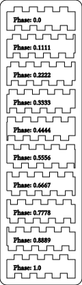
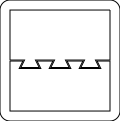
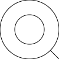

# SHapely ARt Tools

Fluent api wrapper around shapely geometry library.

# Why
Shapely is a very powerful library with awesome features,
but I find its API to be a bit verbose at times. I created
this lib to make my life a bit easier creating laser cutter
art projects.

# Limitations
Since this lib is just a glorified wrapper class, it has the
same limitations shapely does. Namely it does not support
"true" curves (everything is a polygon). I get around this by
estimating the number of segments required for e.g. a circle
based on its size, but it's important to be aware that if you
create a tiny circle and scale it up 100 times it won't be
infinitely detailed. Same goes for any other curve objects.

# Install

At some point I'll get around to adding this to the PIP repository thing.

Clone repo and run
```bash
./build-and-install.sh
```

Note you need the usual set of dependencies required when building pip packages.

# Example Use

Central class of the API is a Group, which is a collection of one or more
geometric objects (backed by a shapely MultiPolygon):

## You can render directly to SVG (Using PyCairo)

`svg_generator` is a lambda that accepts width/height arguments and provides
a cairo surface from which a render context can be created. Use your own
lambda for alternative outputs.

```python
from shart.group import Group
from shart.renderers import RenderBuilder

Group.circle(0, 0, 100).do(
    RenderBuilder()
        .svg()
        .units_mm()
        .file("doc/circle"))
```


## Multiple shapes are allowed

```python
from shart.group import Group
from shart.renderers import RenderBuilder

Group.circle(0, 0, 100)
    .add(Group.circle(0, 0, 50))
    .do(RenderBuilder().svg().file("doc/circle-add"))
```


## Group is immutable so you can easily perform multiple transformations using the same base group

```python
from shart.group import Group
from shart.renderers import RenderBuilder

outer_circle = Group.circle(0, 0, 100)

inner_circle = Group.circle(0, 0, 20)

outer_circle
    .add(inner_circle.to(50, 0))
    .add(inner_circle.to(-50, 0))
    .do(RenderBuilder().svg().file("doc/circles"))

```


## Using union()

```python
from shart.group import Group
from shart.renderers import RenderBuilder

outer_circle
    .add(inner_circle.to(50, 0))
    .add(inner_circle.to(-50, 0))
    .union()
    .do(RenderBuilder().svg().file("doc/circles-union"))
```


## LineString and Polygon based groups

Since there are so many common operations between the two, 
Groups can be constructed from both MultiLineStrings and MultiPolygons.
Whether groups can be combined using `add()` etc. depends on the individual
operation. A MultiPolygon Group can be converted to a MultiLineString 
Group using `to_boundary()`

```python
import shapely as sh
import shapely.geometry
from shart.group import Group
from shart.renderers import RenderBuilder

Group.line(0, 0, 30, 0)\
    .spin(0, 0, 10, geom_centroid=sh.geometry.Point(10, 0), should_rotate=True)\
    .do(RenderBuilder().svg().file("doc/line"))
```


```python
import shapely as sh
import shapely.geometry
from shart.group import Group
from shart.renderers import RenderBuilder

Group.line(0, 0, 30, 0)\
    .spin(0, 0, 10, geom_centroid=sh.geometry.Point(10, 0), should_rotate=True)\
    .do_and_add(lambda g: g.buffer(10).to_boundary())\
    .do(RenderBuilder().svg().file("doc/line"))
```


Note that in the above example, after `buffer()` is called, the resulting Group is of 
type MultiPolygon. Since a MultiPolygon Group cannot be added to a MultiLineString Group,
it is converted to a MultiLineString Group via `to_boundary()`

## Render attributes
Output color/fill can be controlled via attaching attributes to a group.

```python
import shapely as sh
import shapely.geometry
from shart.group import Group
from shart.renderers import RenderBuilder

print("Creating attributes #1")
c1 = Group.circle(0, 0, 100)\
    .add_geom_attribute("fill", True)\
    .add_geom_attribute("color", (1, 0, 0))
c2 = c1.translate(70, 0).add_geom_attribute("color", (0, 1, 0, 0.5))
c3 = c2.translate(70, 0).add_geom_attribute("color", (0, 0, 1, 0.75))
c1.add(c2).add(c3).border(20, 20).do(RenderBuilder().svg().file("doc/attributes-demo-1"))

print("Creating attributes #2")
Group.circle(0, 0, 100).difference(Group.circle(0, 0, 50)) \
    .add_geom_attribute("fill", True) \
    .add_geom_attribute("color", (1, 0, 0)) \
    .border(20, 20)\
    .do(RenderBuilder().svg().file("doc/attributes-demo-2"))
```


## Boolean operations

```python
from shart.group import Group
from shart.renderers import RenderBuilder

center_rect = Group.rect_centered(0, 0, 100, 100)

spin_rects = Group.rect(0, -5, 100, 10)

spin_rects
    .spin(0, 0, 20, should_rotate=True)
    .difference(center_rect)
    .union()
    .do(RenderBuilder().svg().file("doc/boolean"))
```


## Turtle graphics (I LIKE TURTLES O_O)

To make generating line geometries easier, there is a simple turtle graphics class:

```python
from shart.group import Group
from shart.renderers import RenderBuilder
from shart.line_generator import Turtle

circ = Group.circle(0, 0, 120)
Turtle(origin=(0, 0), angle_rad=math.radians(-90))\
    .do(lambda t, i: t.move(3 * i).turn_deg(90), 50)\
    .to_group()\
    .intersection(circ)\
    .add(circ.to_boundary())\
    .border(10, 10)\
    .do(RenderBuilder().svg().file("doc/turtle"))
```

Turtle supports a `do` method with range and index for easy inline looping.


Note that the MultiPolygon Group `circ` can be used directly for the `intersection()` boolean 
operation, but in order to be added it must be converted to a MultiLineString Group.

## Using spin()

```python
from shart.group import Group
from shart.renderers import RenderBuilder

Group.rect_centered(50, 0, 10, 10)
    .spin(0, 0, 10, should_rotate=True)
    .do(RenderBuilder().svg().file("doc/rects"))
```


## Using linarray()

Pass in a lambda which applies the desired transformation for a given increment

```python
from shart.group import Group
from shart.renderers import RenderBuilder

Group.rect_centered(0, 0, 10, 10)
    .linarray(10,
              lambda i, g: g.to(i * 20, 0).rotate(i * 10, use_radians=False))
    .do(RenderBuilder().svg().file("doc/rects-linarray"))
```


## Hexagonal arrays/tiling

### The easy way, using Coordinates

```python
from shart.group import Group
from shart.renderers import RenderBuilder
from shart.coordinates import Coordinates

container = Group.circle(70, 70, 140)

Group()
    .add_all(Group.circle(c[0], c[1], 4) for c in Coordinates.hex(17, 17, 10))
    .filter(lambda g: container.contains(g))
    .add(container)
    .do(RenderBuilder().svg().file("doc/hexagons"))
```


### The hard way, using math (shudder...)

Hexagonal tiles are just arrays with varying numbers of elements in each row.
For a hexagonal arrangement, column (x) spacing is some length l, then row
spacing will be sqrt(3/4)l. In addition, oddly numbered rows will be offset
by l/2.

With this information it's possible to determine the necessary 2d array coords:

```python
import math

from shart.group import Group
from shart.renderers import RenderBuilder

lattice_spacing = 10

row_count = 17
col_count = 17


def gen_row(row_number, g):
    num_cols = col_count if row_number % 2 == 0 else col_count - 1

    row_y = row_number * math.sqrt(3 / 4) * lattice_spacing
    col_x = 0 if row_number % 2 == 0 else lattice_spacing / 2

    # create the first row element
    row_start = g.translate(col_x, row_y)

    # fill in the remainder of the row
    return row_start.linarray(
        num_cols,
        lambda i, g: g.translate(i * lattice_spacing, 0))


lattice = Group.circle(0, 0, 4).linarray(row_count, gen_row)

container = Group.circle(70, 70, 140)

lattice.filter(lambda g: container.contains(g))
    .add(container)
    .do(RenderBuilder().svg().file("doc/hexagons-hard"))
```

Also here I use `filter()` to only include the circles inside the larger circle.

The result is the same.


## Fractals (Hey dawg I heard you like hey dawg I heard you like hey dawg I heard...)

Use the `recurse()` method to generate recursive subgeometries:

```python
import numpy as np

from shart.group import Group
from shart.renderers import RenderBuilder


def get_fractal_visitor(i0, i1, angle=45, scale=0.8):
    def modifier(g):
        pa = g.geoms.geoms[0].boundary.coords[i0]
        pb = g.geoms.geoms[0].boundary.coords[i1]

        pab = tuple(np.subtract(pb, pa))

        subgroup = g.translate(pab[0], pab[1])
            .scale(scale, origin=pb)
            .rotate(angle, origin=pb, use_radians=False)

        return [subgroup]

    return modifier


# stacking recurse operations (careful, gets expensive fast!)
Group.rect(0, 0, 100, 100)
    .recurse(get_fractal_visitor(-2, 1, angle=38, scale=0.8), 15)
    .map_subgroups(lambda g: g.recurse(get_fractal_visitor(1, 3, angle=45, scale=0.6), 4))
    .map_subgroups(lambda g: g.recurse(get_fractal_visitor(-1, 2, angle=45, scale=0.5), 4))
    .border(20, 20)
    .do(RenderBuilder().svg().file("doc/recurse-single"))

```


```python
import numpy as np

from shart.group import Group
from shart.renderers import RenderBuilder


def branching_fractal_visitor(g):
    scale = 0.5
    angle = 10

    top_right = g.geoms.geoms[0].boundary.coords[0]
    top_left = g.geoms.geoms[0].boundary.coords[-2]
    bottom_right = g.geoms.geoms[0].boundary.coords[1]
    bottom_left = g.geoms.geoms[0].boundary.coords[2]

    tl_br = tuple(np.subtract(bottom_right, top_left))
    tr_bl = tuple(np.subtract(bottom_left, top_right))

    subgroup1 = g.translate(tl_br[0], tl_br[1])
        .scale(scale, origin=bottom_right)
        .rotate(angle, origin=bottom_right, use_radians=False)

    subgroup2 = g.translate(tr_bl[0], tr_bl[1])
        .scale(scale, origin=bottom_left)
        .rotate(-angle, origin=bottom_left, use_radians=False)

    return [subgroup1, subgroup2]


Group.rect(0, 0, 100, 100)
    .recurse(branching_fractal_visitor, 6)
    .border(20, 20)
    .do(RenderBuilder().svg().file("doc/recurse-tree"))

```


## Turtle Fractals
You can also create fractal lineart using the Turtle `fork()` method.

```python
import math
from shart.line_generator import Turtle
from shart.renderers import RenderBuilder

forklength = lambda depth: max(0.0, 50 * math.pow(2, -depth))

Turtle().move(100).fork(lambda d, instance: (
            instance().turn_deg(-50).move(forklength(d)),
            instance().turn_deg(-20).move(forklength(d)),
            instance().turn_deg(30).move(forklength(d))
        ), 4)\
    .to_group()\
    .border(20, 20)\
    .do(RenderBuilder().svg().file("doc/turtle-fork"))
```
This generates some broccoli:


## Combining multiple operations

```python
import math

from shart.group import Group
from shart.renderers import RenderBuilder
from shart.coordinates import Coordinates

flower = Coordinates.polar(300, lambda t: 10 + 150 * abs(math.cos(t * 3))).to_group()

hexagon = Coordinates.polar(6, lambda t: 2).to_group()
hexagons = Group().add_all(
    hexagon.to(c[0], c[1]) for c in Coordinates.hex_covering(4 * math.sqrt(4 / 3), flower, row_parity=True))

bars = Group()
    .add_all(Group.rect_centered(0, c[1], 320, 20) for c in Coordinates.linear(10, dy=40, centered_on=(0, 0)))
    .intersection(flower)

hexagons
    .filter(lambda g: flower.covers(g))
    .filter(lambda g: not bars.intersects(g))
    .add(bars)
    .add(
    flower.do_and_add(lambda f: f.buffer(10).add(f.buffer(15)))
)
    .border(10, 10)
    .do(RenderBuilder().svg().file("doc/polar-w-boolean"))

```


## WIP: finger joint boxes

You can cut finger joints as well as slots (needs some real world testing :) )

```python
import shapely as sh

from shart.group import Group
from shart.renderers import RenderBuilder

from shart.box import *

fgen_male = FingerGenerator.create_for_length(100, 5, True, 6.5, 1, 0.1)
fgen_female = FingerGenerator.create_for_length(100, 5, False, 6.5, 1, 0.1)

bf = BoxFace(sh.geometry.box(0, 0, 100, 100))

# bottom
bf.assign_edge(2, fgen_male)

# top
bf.assign_edge(0, fgen_female)

# right
bf.assign_edge(3, fgen_female)

# left
bf.assign_edge(1, fgen_male)

bf.generate_group()
    .union()
    .do_and_add(lambda g: g.translate(121, 0))
    .do_and_add(lambda g: g.translate(0, 121))
    .add(fgen_male.get_slots(((50, 0), (50, 100))).do(lambda s: s.translate(-s.bounds_width / 2, 0)))
    .border(20, 20)
    .do(RenderBuilder().svg().file("doc/finger-joint"))
```


## Finger joint Phases
It is possible to change the duty cycle (finger on/off) as well as phase.
By default the phase is 0.5 as this gives a pleasing appearance. Below are male
and female profiles for various phases.



# Creating mating profiles
It is possible to use the SlotGenerator to buffer geometries with appropriate
kerf + clearance:

```python
import shapely as sh
import shapely.geometry

from shart.group import Group
from shart.renderers import RenderBuilder

from shart.box import *

# clearance set to 2 linewidths for clarity
sg = SlotGenerator(kerf=1, clearance=2)

# dovetails
dovetails = Group.from_geomarray([sh.geometry.Polygon([(0, 0), (1, 0), (1.5, 1), (-0.5, 1)])])\
    .scale(10, 10, origin=(0, 0))\
    .linarray(3, lambda i, g: g.to(15 + i * 30, 48, center=(0, 0)))

sheet_a = Group.rect(0, 0, 100, 50)
sheet_b = sheet_a\
    .translate(0, sheet_a.bounds_height)\
    .translate(0, sg.get_object_separation())  # add the offset required to mate the profiles with the desired clearance

sheet_a = sheet_a.add(sg.buffer_profile(dovetails, False)).union()
sheet_b = sheet_b.difference(sg.buffer_profile(dovetails, True))

Group.arrange([ sheet_a.add(sheet_b), sheet_a, sheet_b ], 10)\
    .border(10, 10)\
    .do(RenderBuilder().svg().file("doc/dovetail"))
```



(Showing the mated profiles + the cut arrangement)

# Rendering geometries not based on a group

```python
import shapely as sh

import math

from shart.group import Group
from shart.renderers import RenderBuilder

extra_geoms = [sh.geometry.LineString([(50 / math.sqrt(2), 50 / math.sqrt(2)), (100, 100)])]
Group.circle(0, 0, 100)
    .add(Group.circle(0, 0, 50))
    .do(RenderBuilder()
    .svg()
    .file("doc/non-group")
    .post_render_callback(
    lambda geom_r, prim_r: [geom_r.render(eg, prim_r) for eg in extra_geoms]))
```



# Creating a Group from text

```python
from shart.group import Group
from shart.renderers import RenderBuilder

Group.from_text("Hi world", "Linux Libertine O", 50)
    .border(10, 10)
    .do(RenderBuilder().svg().file("doc/text"))
```

This honestly does not work all that well (boolean ops etc.) and is kind of an afterthought. Text is useful to be able 
to place for debugging purposes though. Remember that once created, a Group representing text is just another 
MultiPolygon.

_I can't predict what fonts you have on your machine, but it seems safe to assume "Linux Libertine O" won't be available on 
Windows ;p_


## Accessing the underlying MultiPolygon

Since the API will never give you everything you could possibly want to do,
You can just grab the underlying shapely MultiPolygon like so:

```python
>>> from shart.group import Group
>>> my_group = Group.circle(0, 0, 10)
>>> type(my_group.geoms)
<class 'shapely.geometry.multipolygon.MultiPolygon'>
```

You can just create a new group from a MultiPolygon

```
my_group = Group(my_old_group.geoms)
```

